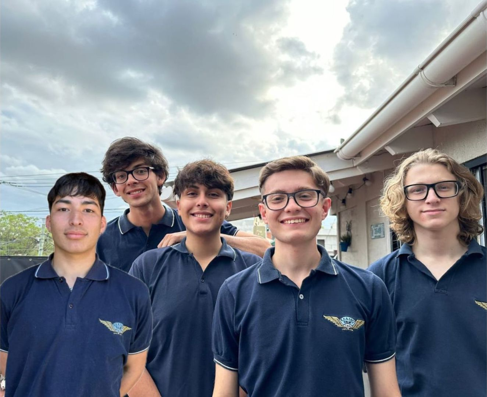

## ¿Qué es HealthBand?

**HealthBand** propone un sistema de monitoreo de salud continuo e inteligente :thermometer:. Utilizará un dispositivo *wearable* que censará diferentes parámetros de salud, como frecuencia cardíaca, oxigenación sanguínea, temperatura corporal y movimiento :heart:. El dispositivo será programado para detectar niveles de salud anormales y emitir alertas en formas de vibraciones.

La incorporación de un Bot de Telegram 💬: permitirá recibir alertas, consultar el estado de salud e información general.

Su funcionamiento se complementará al de una aplicación móvil :iphone:, la cuál le permitirá al usuario disponer de su estado de salud en cualquier momento, así como tener acceso a registros previos, descargarlos y compartirlos.

## Objetivos

Buscamos diseñar un sistema capaz de monitorear los signos vitales de una persona de forma inteligente y de fácil interpretación para sus usuarios,  siendo capaz de activar un protocolo de emergencias cuando se presente una complicacion de salud y salvar vidas. 

## ¿Quienes somos?

### Somos un grupo de Estudiantes del séptimo año de la **Escuela Técnica N°7- IMPA**, de la especialidad **Aviónica**.

Pagano, Tobias: 
Instagram: @tobiass.p

Mail: paganotobias05@gmail.com

Gomez, Gonzalo:
Instagram: @gomez.gonza01

Mail: gonzalogomez9673@gmail.com

Giulianetti Bruno
Instagram: @br1egm

Mail: zazitag@gmail.com

Acuña, Alvaro:
Mail: alvarodaniel977@gmail.com

Perlo, Mateo:
Instagram: @mateo.perlo32

Mail: mateoperlo22@gmail.com

Seguinos en nuestro perfil oficial de Instagram : [@healthband.aid](https://www.instagram.com/healthband.aid/)

Consultanos vía mail a 📧: (mailto:healthband.aid@gmail.com) 
